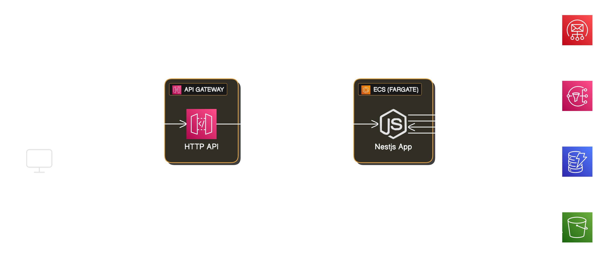

# Expense API

A RESTful API for managing expenses built with NestJS and DynamoDB, following Clean Architecture principles.

## Architecture Diagram
<p align="center">
    
</p>

## Architecture

This project follows Clean Architecture:

```
src/
├── domain/              # Business logic & entities (no dependencies)
│   ├── entities/        # Domain entities
│   ├── repositories/    # Repository interfaces
│   ├── exceptions/      # Custom exceptions
│   └── types/          # Type definitions
├── application/         # Use cases & business rules
├── infrastructure/      # External implementations
│   ├── database/       # Database configuration
│   └── repository/     # Repository implementations (DynamoDB)
```

### Dependency Inversion

- **Domain layer** defines repository interfaces
- **Infrastructure layer** implements these interfaces with DynamoDB
- Application code depends on abstractions, not concrete implementations
- Easy to swap database implementations (e.g., PostgreSQL, MongoDB) without changing domain logic

## Installation

```bash
$ yarn install
```

## Environment Variables

Create a `.env` file in the root directory:

```env
# AWS Configuration
AWS_REGION=us-east-1
AWS_ACCESS_KEY_ID=your-access-key
AWS_SECRET_ACCESS_KEY=your-secret-key

# DynamoDB Configuration
DYNAMODB_ENDPOINT=http://localhost:8000  # For local
GROUPS_TABLE_NAME=Groups
MEMBERS_TABLE_NAME=Members
EXPENSES_TABLE_NAME=Expenses
```

## DynamoDB Setup

### Local Development

Use DynamoDB Local for development:

```bash
# Using Docker
docker run -p 8000:8000 amazon/dynamodb-local

# Or install DynamoDB Local directly
# Download from: https://docs.aws.amazon.com/amazondynamodb/latest/developerguide/DynamoDBLocal.html
```

### Table Schema

#### Groups Table
- Primary Key: `id` (String)
- Attributes: `name`, `members[]`, `expenses[]`, `createdAt`, `updatedAt`

#### Members Table
- Primary Key: `id` (String)
- GSI: `GroupIdIndex` - `groupId` (String)
- Attributes: `name`, `groupId`, `createdAt`, `updatedAt`

#### Expenses Table
- Primary Key: `id` (String)
- Attributes: `name`, `amountInCents`, `payerId`, `participants[]`, `groupId`, `createdAt`, `updatedAt`

## Running the app

```bash
# Development
yarn run start:dev

# Production
yarn run build
yarn run start:prod
```

## Testing

```bash
# Unit tests
yarn test

# Watch mode
yarn run test:watch

# Test coverage
yarn run test:cov

# E2E tests
yarn run test:e2e
```

## Project Structure

### Domain Layer

**Entities:**
- `Group` - Manages members and expenses
- `Member` - Represents a group member
- `Expense` - Represents an expense with payer and participants

**Repository Interfaces:**
- `IGroupRepository` - Group data operations
- `IMemberRepository` - Member data operations
- `IExpenseRepository` - Expense data operations

**Custom Exceptions:**
- `MemberAlreadyExistsError` - Thrown when adding duplicate member
- `PayerNotMemberError` - Thrown when payer is not in group
- `ParticipantNotMemberError` - Thrown when participant is not in group

### Infrastructure Layer

**DynamoDB Implementations:**
- `DynamoDBGroupRepository` - Implements `IGroupRepository`
- `DynamoDBMemberRepository` - Implements `IMemberRepository`
- `DynamoDBExpenseRepository` - Implements `IExpenseRepository`

## Key Features

- **Balance Calculation** - Automatically calculates member balances
- **Remainder Distribution** - Handles expenses that don't divide evenly
- **Validation** - Ensures all participants and payers are group members
- **Type Safety** - Full TypeScript support with strict typing
- **Test Coverage** - Comprehensive unit tests for all entities

## License

UNLICENSED
